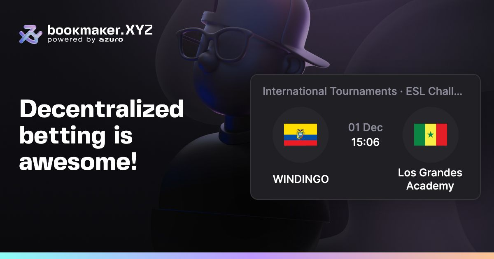
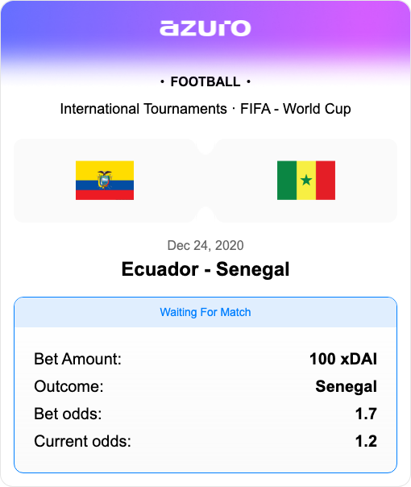

# @azuro-org/images-generator

## Usage

```typescript
import { generateImage } from '@azuro-org/images-generator';
import template, { type Props } from '@azuro-org/images-generator/lib/templates/bet-nft';

const props: Props = {
  // ...
}

// get image buffer
const buffer = generateImage({
  template,
  props,
})

// create image file
generateImage({
  template,
  props,
  output: './dist',
})
```

## Options

```typescript
type PuppeteerOptions = Parameters<typeof puppeteer.launch>[0]

type PuppeteerInitialOptions = {
  headless: boolean
  devtools: boolean
  args: string[]
}

generateImage({
  output?: string // output filepath
  filename?: string // default "image"
  props: any
  modifyPuppeteerOptions?(options: PuppeteerInitialOptions): PuppeteerOptions
})
```


# Examples

<details>
<summary><h3>Bet Opengraph</h3></summary>
<p>

```typescript
import { generateImage } from '@azuro-org/images-generator';
import template from '@azuro-org/images-generator/lib/templates/bet-og';

generateImage({
  template,
  props: {
    title: 'Decentralized betting is awesome!',
    game: {
      country: 'International Tournaments',
      league: 'ESL Challenger League North America',
      participants: [
        {
          name: 'WINDINGO',
          image: 'https://content.bookmaker.xyz/avatars/provider-3/4757.png',
        },
        {
          name: 'Los Grandes Academy',
          image: 'https://content.bookmaker.xyz/avatars/provider-3/4739.png',
        },
      ],
      startsAt: Date.now(),
    }
  },
})
```

### Result

<p>
  
</p>
</p>
</details>

<details>
<summary><h3>Bet NFT</h3></summary>
<p>

```typescript
import { generateImage } from '@azuro-org/images-generator';
import template from '@azuro-org/images-generator/lib/templates/bet-nft';

generateImage({
  template,
  props: {
    type: 'match',
    sport: 'Football',
    league: 'International Tournaments · FIFA - World Cup',
    team1: {
      img: 'https://content.bookmaker.xyz/avatars/provider-3/4757.png',
      name: 'Ecuador',
    },
    team2: {
      img: 'https://content.bookmaker.xyz/avatars/provider-3/4739.png',
      name: 'Senegal',
    },
    date: 'Dec 24, 2020',
    betAmount: '100 xDAI',
    outcome: 'Senegal',
    betOdds: '1.7',
    currentOdds: '1.2',
  },
})
```

### Result

<p>
  
</p>
</p>
</details>


# Contributing

## Add new template

1. Copy `templates/_template` to `templates/{your_template_name}`.
3. Use `index.html` for HTML. Write CSS in `index.html` file.
4. Create `templates/{your_template_name}/images` folder for images if required.


## Setup generator

Edit `{your_template_name}/index.ts` file:

```typescript
import path from 'path'

import { type Template, getFile, downloadImage, createGenerator } from '../../utils'

export type Props = {
  team1ImageSrc: string
  team2ImageSrc: string
  date: string
}

const template = {
  width: 800,
  height: 400,
  type: 'jpeg',
  html: async (props: Props) => {
    const { team1ImageSrc, team2ImageSrc, date } = props

    const html = getFile(path.join(__dirname, 'index.html'))

    const team1Img = await downloadImage(team1ImageSrc)
    const team2Img = await downloadImage(team2ImageSrc)

    return html
      .replace('{image1}', team1Img)
      .replace('{image2}', team2Img)
      .replace('{date}', date)
  },
}

export default template
```

## Publish

Publish npm package with `npm run publish`. For access to `@azuro-org` scope ask Pavel Ivanov or Stas Onatskiy.
